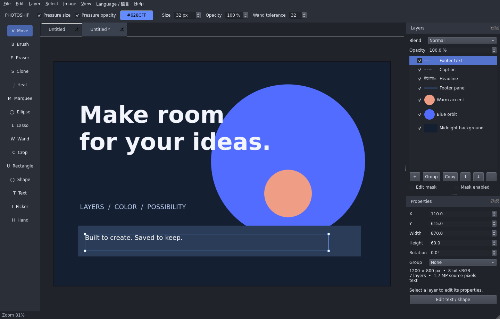

[简体中文](README.zh_CN.md) · [English](README.md) · [日本語](README.ja.md) · [한국어](README.ko.md) · [Français](README.fr.md) · [Deutsch](README.de.md) · [Español](README.es.md)

# PhotoShip

<p align="center">
  
</p>

**Un editor de imágenes ligero con capas para Ubuntu y Windows.**

PhotoShip está creado con Qt 6 y C++17 y ofrece pinceles, selecciones, máscaras, ajustes no destructivos y proyectos editables para edición básica, composición y creación gráfica. El código de la aplicación se distribuye bajo la [licencia MIT](LICENSE).

[Flujo de compilación](https://github.com/wolfoot/PhotoShip/actions/workflows/build.yml) · [Informar de un problema](https://github.com/wolfoot/PhotoShip/issues) · [Licencias de terceros](THIRD_PARTY_NOTICES.md)



## Funciones

| Categoría | Funciones disponibles |
| --- | --- |
| Documentos y capas | Pestañas, grupos anidados, selección múltiple, ordenación por arrastre, duplicación/eliminación por lotes y combinación de capas adyacentes |
| Pintura y retoque | Pincel, borrador, cuentagotas, presión de tableta, tampón de clonado y corrección básica |
| Selecciones y transformaciones | Selecciones rectangulares/elípticas, lazo, varita para áreas contiguas, mover/copiar píxeles seleccionados, mover, escalar, girar, voltear y recortar |
| Composición | 12 modos de fusión, opacidad, máscaras ráster, máscaras de recorte, texto editable y formas rectangulares/elípticas |
| Ajustes | Niveles, curvas RGB, tono/saturación/brillo e inversión mediante capas de ajuste o cambios directos en los píxeles |
| Archivos | Importación/exportación PNG/JPEG, importación básica de PSD y Compositor `.comp`, proyectos `.psproj` editables |
| Flujo de trabajo | Deshacer/rehacer, guardado/exportación en segundo plano, recuperación automática, portapapeles, importación por arrastre y caché de mosaicos visibles |
| Idiomas | Chino simplificado, inglés, japonés, coreano, francés, alemán y español; cambio inmediato con preferencias guardadas |

Versión actual: **0.2.1**. Ubuntu se ha compilado, comprobado automáticamente y probado en X11 de forma local. Se incluyen scripts de compilación y empaquetado para Windows, pero aún requieren validación en Windows. Las pruebas de tableta usan eventos simulados; la compatibilidad real depende del dispositivo y del controlador.

## Obtención e instalación

### Ubuntu

Requisitos de compilación: Ubuntu 22.04/24.04 x86_64, Qt 6.2+, CMake 3.21+ y un compilador C++17.

```bash
git clone https://github.com/wolfoot/PhotoShip.git
cd PhotoShip
sudo apt update
sudo apt install qt6-base-dev qt6-qpa-plugins zlib1g-dev cmake ninja-build g++
./scripts/build-linux.sh
```

El script compila la aplicación, ejecuta las comprobaciones y genera `dist/photoship-0.2.1-Linux.deb`:

```bash
sudo apt install ./dist/photoship-0.2.1-Linux.deb
photoship
```

El DEB se enlaza dinámicamente con el Qt del sistema; apt instala las dependencias necesarias. Instala `fonts-noto-cjk` si faltan fuentes chinas, japonesas o coreanas. Para una instalación sin conexión, prepara antes las bibliotecas y fuentes.

Durante el desarrollo puedes ejecutar la aplicación desde el directorio de compilación:

```bash
./scripts/run.sh
./scripts/run.sh --demo
./scripts/run.sh /absolute/path/to/project.psproj
```

### Windows

Plataforma objetivo: Windows 10/11 x64. Prepara:

- Visual Studio 2022 con la carga de trabajo **Desktop development with C++**.
- CMake y el componente **MSVC 2022 64-bit** de Qt 6.8.3.
- vcpkg con `zlib:x64-windows-static-md` para decodificar ZIP de PSD.
- Inno Setup 6, solo para generar el instalador.

Ejecuta PowerShell en el directorio del proyecto:

```powershell
vcpkg install zlib:x64-windows-static-md
./scripts/build-windows.ps1 -QtPrefix 'C:\Qt\6.8.3\msvc2022_64' -ZlibToolchain 'C:\vcpkg\scripts\buildsystems\vcpkg.cmake'
```

Se genera el paquete portátil `dist/PhotoShip-0.2.1-windows-x64.zip` con las bibliotecas Qt. Descomprímelo y ejecuta `photoship.exe`. Añade `-Installer` para generar `dist/PhotoShip-0.2.1-windows-x64-setup.exe`, que se instala por defecto en el directorio del usuario actual.

El [flujo de GitHub Actions](.github/workflows/build.yml) configura compilaciones, comprobaciones y carga de artefactos para ambas plataformas. Descarga los artefactos de ejecuciones satisfactorias. La configuración del flujo por sí sola no confirma la validación de una plataforma.

## Uso

1. Crea un documento o abre una imagen y selecciona la capa que quieras editar en el panel de capas.
2. Pinta, selecciona y transforma con la barra izquierda. Introduce valores precisos en el panel de propiedades derecho.
3. Usa el menú Capa para máscaras, recorte y combinación, y el menú Imagen para crear capas de ajuste.
4. Usa **Guardar proyecto** para conservar el contenido editable y **Exportar PNG / JPEG** para una imagen acoplada.

Con las herramientas de clonado y corrección, elige primero un origen mediante **Alt-clic** en la misma capa ráster. La corrección iguala tonos RGB locales para retoques básicos. En una máscara, el negro oculta y el blanco muestra.

La combinación exige capas adyacentes del mismo nivel con modo Normal. Las dependencias de recorte/ajuste o los grupos superiores translúcidos pueden impedirla para preservar la imagen. Los grupos usan composición pass-through, por lo que los ajustes pueden afectar a contenido inferior fuera del grupo.

### Idiomas

Elige un idioma en **Language / 语言** sin reiniciar. El primer inicio sigue el idioma del sistema y usa inglés si no está disponible. El cambio conserva el contenido, los nombres de capas y el historial de deshacer.

Puedes indicar el idioma para un solo inicio sin cambiar la preferencia guardada:

```bash
./scripts/run.sh --language es
# en / zh_CN / ja / ko / fr / de / es
```

Los menús, paneles, diálogos de edición y mensajes habituales están traducidos. Algunos diagnósticos originales del analizador y del sistema pueden seguir en inglés.

### Atajos habituales

| Acción | Atajo |
| --- | --- |
| Mover / pincel / borrador | V / B / E |
| Clonar / corregir | S / J, Alt-clic para elegir el origen |
| Rectángulo / elipse / lazo / varita | M / Shift+M / L / W |
| Recortar / forma rectangular / forma elíptica | C / U / Shift+U |
| Texto / cuentagotas / mano | T / I / H |
| Desplazar vista / zoom | Arrastrar con Espacio o botón central / rueda |
| Tamaño del pincel | [ / ] |
| Deshacer / rehacer | Ctrl+Z / Ctrl+Y / Ctrl+Shift+Z |
| Nuevo / abrir / guardar / guardar como | Ctrl+N / Ctrl+O / Ctrl+S / Ctrl+Shift+S |
| Importar / exportar | Ctrl+Shift+O / Ctrl+Shift+E |
| Duplicar capa / combinar capas seleccionadas | Ctrl+J / Ctrl+E |
| Alternar máscara de recorte | Ctrl+Alt+G |
| Seleccionar todo / deseleccionar | Ctrl+A / Ctrl+D |
| Ajustar lienzo / píxeles reales | Ctrl+0 / Ctrl+1 |
| Cancelar trazo o arrastre | Esc |

## Archivos y almacenamiento de datos

### Proyectos editables

Un proyecto `.psproj` es una carpeta con `manifest.json` e `images/`; conserva toda la carpeta al mover o hacer una copia de seguridad. Guarda capas, grupos, máscaras, transformaciones, texto y parámetros de ajuste. No guarda selecciones, historial de deshacer ni posición de la vista. El texto usa fuentes locales, que pueden sustituirse en otro equipo.

El guardado escribe nuevos archivos y confirma el manifiesto de forma atómica, con un bloqueo que evita escrituras simultáneas. El guardado en segundo plano captura el estado al empezar; los cambios posteriores requieren otro guardado. Exportar una imagen no marca el proyecto como guardado.

La recuperación automática escribe una instantánea unos 1,5 segundos después de dejar de editar y comprueba también cada 30 segundos. Al iniciar, puedes restaurar, descartar o conservar las instantáneas. La restauración abre documentos separados sin guardar y preserva los originales. Los cambios cuya instantánea no haya terminado pueden no recuperarse.

PhotoShip conserva el identificador `org.pixelstudio.project` y las ubicaciones del antiguo Pixel Studio para preservar proyectos, preferencias de idioma e instantáneas existentes. El formato actual es la versión 2 y lee la versión 1. Usa `PHOTOSHIP_RECOVERY_DIR` para elegir el directorio de recuperación; también se admite el antiguo `PIXELSTUDIO_RECOVERY_DIR`.

### Importación PSD y Compositor

La importación admite PSD v1, RGB de 8 bits, capas ráster, grupos, máscaras ráster y algunas relaciones de recorte. Los canales pueden usar raw, RLE, ZIP o ZIP con predicción. Se muestra un informe de compatibilidad antes de importar. Texto, vectores, objetos inteligentes, efectos y ajustes pueden sustituirse por píxeles en caché u omitirse. No se admite exportación PSD.

La importación básica `.comp` admite capas ráster, grupos, transformaciones, modos de fusión compatibles y máscaras ráster vinculadas. Las funciones no compatibles generan un error. Guarda el documento importado como `.psproj` para conservar los archivos originales.

## Limitaciones actuales

- La composición usa CPU/QPainter con mosaicos de 256×256 para la vista. Algunos filtros, el análisis PSD y las operaciones estructurales siguen ejecutándose en el hilo principal.
- Máximo de 8192 píxeles por lado y 16 millones en el lienzo; 32 millones de píxeles de origen y otros 32 millones de máscara; 256 capas. Los PSD están limitados a 256 MiB.
- Deshacer admite hasta 100 pasos con un presupuesto aproximado de 256 MiB para los búferes de píxeles del historial. Imágenes, cachés e instantáneas usan memoria adicional; no es un límite global del proceso.
- El espacio de trabajo es sRGB de 8 bits. No se admiten PSB, RAW, edición de 16 bits/CMYK, trazados de pluma, texto enriquecido, estilos avanzados, máscaras de grupo, licuar ni recorte con IA.
- PNG/JPEG son los formatos básicos; otros dependen de los plugins Qt instalados. La importación PSD y las fórmulas de fusión no garantizan coincidencia píxel a píxel con otros editores.

## Desarrollo y contribuciones

El proyecto utiliza C++17, Qt 6 Widgets/Concurrent y zlib. La aplicación no requiere servicio de red ni cuenta. Directorios principales:

```text
src/                 Interfaz, modelo de documento, composición, lectura/escritura de proyectos y PSD
assets/i18n/         Catálogos de idiomas integrados
packaging/           Entrada de escritorio, iconos, configuración del instalador y licencias
scripts/             Compilación, inicio, generación de iconos y comprobaciones X11
tests/               Comprobaciones del núcleo, funciones v2 y traducciones
third_party/         Código de terceros con sus licencias originales
```

Comandos generales de compilación y comprobación:

```bash
cmake -S . -B build -G Ninja -DCMAKE_BUILD_TYPE=Release
cmake --build build --parallel 4
QT_QPA_PLATFORM=offscreen ctest --test-dir build --output-on-failure
```

Las comprobaciones automáticas cubren composición, selecciones, deshacer, archivos de proyecto, decodificación PSD, guardado en segundo plano, recuperación e idiomas. Con Xvfb instalado puedes comprobar el inicio de la ventana X11:

```bash
python3 scripts/check-x11.py --language es
```

El icono original **Layer Sail** parte de `packaging/photoship.svg`, con siete tamaños PNG y un ICO de Windows. Tras editar el SVG, regenera los archivos con `python3 scripts/render-icons.py`; requiere Linux librsvg, Cairo y Python Pillow. Las traducciones están en `assets/i18n/*.json`; vuelve a compilar después de cambiarlas.

En [Issues](https://github.com/wolfoot/PhotoShip/issues), indica pasos de reproducción, sistema operativo, versión Qt y archivos de ejemplo. Se agradecen pull requests de correcciones, traducciones y funciones. Conserva la compatibilidad de los formatos y ejecuta las comprobaciones pertinentes. Elimina información personal de proyectos, capturas y registros enviados.

## Licencia y agradecimientos

El código de PhotoShip se distribuye bajo la [licencia MIT](LICENSE). El flujo de capas se inspira en Compositor y reutiliza su código MIT de varita mágica y seguimiento de contornos. Las menciones originales se conservan en [third_party/compositor/LICENSE](third_party/compositor/LICENSE).

Qt, sus plugins y zlib tienen licencias propias que no sustituye la licencia MIT de la aplicación. Conserva los avisos y cumple los requisitos al distribuir. Consulta [THIRD_PARTY_NOTICES.md](THIRD_PARTY_NOTICES.md).

PhotoShip es un proyecto independiente, sin relación con Adobe, y no contiene código ni recursos de Photoshop.
