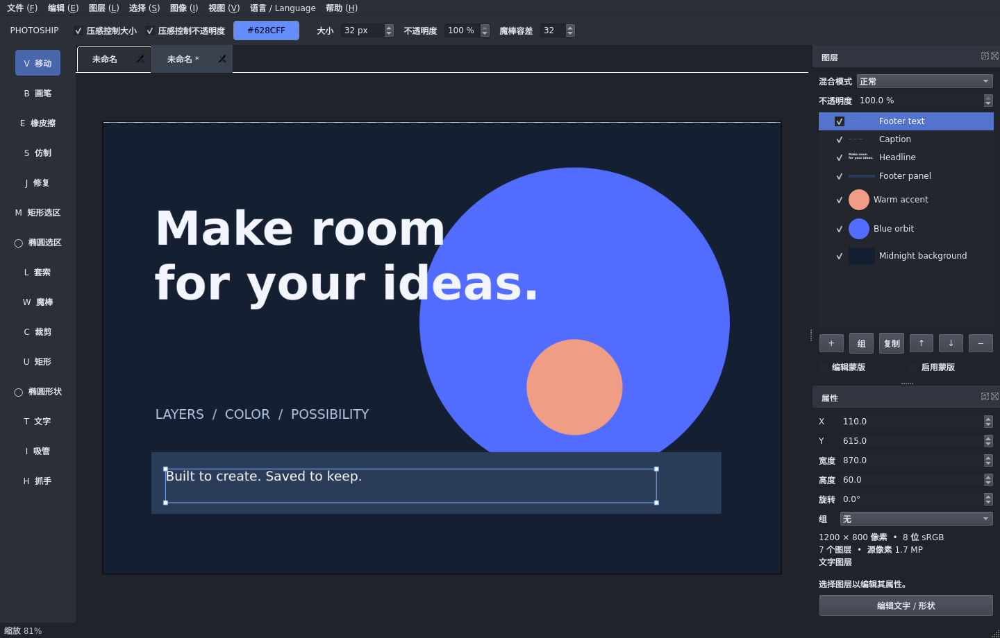

[简体中文](README.zh_CN.md) · [English](README.md) · [日本語](README.ja.md) · [한국어](README.ko.md) · [Français](README.fr.md) · [Deutsch](README.de.md) · [Español](README.es.md)

# PhotoShip

<p align="center">
  
</p>

**面向 Ubuntu 和 Windows 的轻量图层图像编辑器。**

A lightweight, layer-based image editor built with Qt 6 and C++17.

PhotoShip 提供画笔、选区、图层蒙版、非破坏调整和可编辑项目保存，适合基础图像编辑、合成与图形创作。应用代码采用 [MIT 许可证](LICENSE)。

[构建工作流](https://github.com/wolfoot/PhotoShip/actions/workflows/build.yml) · [问题反馈](https://github.com/wolfoot/PhotoShip/issues) · [第三方许可](THIRD_PARTY_NOTICES.md)



## 功能

| 分类 | 已支持 |
| --- | --- |
| 文档与图层 | 多文档标签、图层分组与嵌套、多选、拖动排序、批量复制/删除、相邻图层合并 |
| 绘画与修整 | 画笔、橡皮、前景色吸管、数位板压感、仿制与基础修复工具 |
| 选择与变换 | 矩形/椭圆选区、套索、连续魔棒、选区像素移动/复制、移动、缩放、旋转、翻转、裁剪 |
| 图层合成 | 12 种混合模式、透明度、栅格蒙版、剪贴蒙版、可编辑文字和矩形/椭圆形状 |
| 调整 | 色阶、RGB 曲线、色相/饱和度/明度、反相；支持调整图层或直接修改像素 |
| 文件 | PNG/JPEG 导入导出、基础 PSD 导入、基础 Compositor `.comp` 导入、可编辑 `.psproj` 项目 |
| 工作流 | 撤销/重做、后台保存与导出、自动恢复、剪贴板、拖放导入、视口图块缓存 |
| 语言 | 简体中文、英语、日语、韩语、法语、德语、西班牙语，支持即时切换并保存偏好 |

当前版本：**0.2.1**。Ubuntu 已完成本地构建、自动检查和 X11 启动验证；Windows 10 x64 已使用 Visual Studio 2022 17.0、Qt 6.2.4 和静态 zlib 1.3.1 完成本地 Release 编译、三组测试及解压便携包后的启动验证。Inno Setup 安装器和 Windows 11 尚未完成本地验证。数位板检查使用模拟事件，真实硬件兼容性取决于设备与驱动。

## 获取与安装

### Ubuntu

构建基线：Ubuntu 22.04/24.04 x86_64、Qt 6.2+、CMake 3.21+、C++17 编译器。

```bash
git clone https://github.com/wolfoot/PhotoShip.git
cd PhotoShip
sudo apt update
sudo apt install qt6-base-dev qt6-qpa-plugins zlib1g-dev cmake ninja-build g++
./scripts/build-linux.sh
```

脚本会编译应用、运行检查并生成 `dist/photoship-0.2.1-Linux.deb`：

```bash
sudo apt install ./dist/photoship-0.2.1-Linux.deb
photoship
```

DEB 动态依赖系统 Qt；通过 apt 安装时会补齐依赖。中日韩字体缺失时安装 `fonts-noto-cjk`。离线安装需提前准备运行库和字体。

开发时可直接启动构建目录中的程序：

```bash
./scripts/run.sh
./scripts/run.sh --demo
./scripts/run.sh /absolute/path/to/project.psproj
```

### Windows

目标平台：Windows 10/11 x64。准备以下工具：

- Visual Studio 2022，安装 **Desktop development with C++** 工作负载。
- CMake 3.21+（也可使用 Visual Studio 的 CMake 组件），以及 Qt 6.2+ 的 MSVC x64 组件。CI 使用 Qt 6.8.3 **MSVC 2022 64-bit**；Qt 6.2.4 **MSVC 2019 64-bit** 也可配合 Visual Studio 2022 使用。
- vcpkg 和 `zlib:x64-windows-static-md`，用于 PSD ZIP 解码。
- Inno Setup 6，仅在生成安装器时需要。

尚未安装 vcpkg 时，先克隆并初始化（按实际安装位置修改路径）：

```powershell
git clone https://github.com/microsoft/vcpkg.git C:\vcpkg
& 'C:\vcpkg\bootstrap-vcpkg.bat'
```

在项目目录运行 PowerShell。脚本会自动查找 Visual Studio 2022；PATH 中没有 CMake 时，使用其自带的 CMake：

```powershell
& 'C:\vcpkg\vcpkg.exe' install zlib:x64-windows-static-md
./scripts/build-windows.ps1 -QtPrefix 'C:\Qt\6.8.3\msvc2022_64' -ZlibToolchain 'C:\vcpkg\scripts\buildsystems\vcpkg.cmake'
```

生成含 Qt 和 Visual C++ 运行库的便携包 `dist/PhotoShip-0.2.1-windows-x64.zip`，解压后运行 `photoship.exe`。脚本会在部署前清空 `dist/windows`，避免混入旧版本文件。追加 `-Installer` 可生成 `dist/PhotoShip-0.2.1-windows-x64-setup.exe`，默认安装至当前用户目录；需要安装 Inno Setup 6，若安装在非默认目录，应将 `ISCC.exe` 加入 PATH。

若已有使用 MSVC DLL 运行库编译的 x64 静态 zlib，可省略 vcpkg：将 `$env:ZLIB_ROOT` 设为其安装前缀（含 `include/zlib.h`、`include/zconf.h` 和 `lib/zlib.lib`），并省略 `-ZlibToolchain`。`-QtPrefix` 应使用实际 Qt 安装路径；已配置环境变量时可写成 `-QtPrefix $env:QT_ROOT_DIR`。更换编译器，或在 vcpkg 与其他依赖方案之间切换时，应使用独立构建目录或先删除 `build-windows`。

仓库中的 [GitHub Actions 工作流](.github/workflows/build.yml) 配置了两种平台的构建、检查和产物上传。可从成功的工作流运行中下载构建产物；工作流配置本身不代表对应平台已完成验证。

## 使用

1. 新建文档或打开图片，通过图层面板选择要编辑的图层。
2. 使用左侧工具栏绘画、选择和变换；右侧属性面板可输入精确变换值。
3. 通过图层菜单添加蒙版、设置剪贴或合并图层；通过图像菜单创建调整图层。
4. 用 **保存项目** 保留可编辑内容，用 **导出 PNG / JPEG** 输出合并后的图像。

仿制与修复工具先按住 **Alt** 在同一个栅格图层上点击取样，再绘制。修复采用局部 RGB 色调匹配，适合基础修整。编辑蒙版时，黑色隐藏、白色显示。

合并要求选中图层相邻、同级且采用 Normal 混合模式。剪贴/调整依赖或透明祖先分组可能导致合并被拒绝，以避免改变画面。分组采用 pass-through 合成，调整层可影响组外下方内容。

### 语言

在 **Language / 语言** 菜单选择语言，无需重启。首次启动跟随系统语言，不支持的系统语言回退到英语。界面切换保留文档内容、图层名称和撤销历史。

也可仅为本次启动指定语言，不覆盖保存的偏好：

```bash
./scripts/run.sh --language zh_CN
# 可选：en、zh_CN、ja、ko、fr、de、es
```

菜单、面板、编辑对话框和常用提示已本地化；部分解析器与操作系统返回的原始诊断仍可能是英语。

### 常用快捷键

| 操作 | 快捷键 |
| --- | --- |
| 移动 / 画笔 / 橡皮 | V / B / E |
| 仿制 / 修复 | S / J，Alt 点击取样 |
| 矩形 / 椭圆选区 / 套索 / 魔棒 | M / Shift+M / L / W |
| 裁剪 / 矩形形状 / 椭圆形状 | C / U / Shift+U |
| 文字 / 吸管 / 抓手 | T / I / H |
| 平移 / 缩放 | 空格拖动或中键 / 滚轮 |
| 画笔大小 | [ / ] |
| 撤销 / 重做 | Ctrl+Z / Ctrl+Y 或 Ctrl+Shift+Z |
| 新建 / 打开 / 保存 / 另存 | Ctrl+N / Ctrl+O / Ctrl+S / Ctrl+Shift+S |
| 导入 / 导出 | Ctrl+Shift+O / Ctrl+Shift+E |
| 复制图层 / 合并选中图层 | Ctrl+J / Ctrl+E |
| 切换剪贴蒙版 | Ctrl+Alt+G |
| 全选 / 取消选择 | Ctrl+A / Ctrl+D |
| 适合窗口 / 实际像素 | Ctrl+0 / Ctrl+1 |
| 取消笔画或拖动 | Esc |

## 文件与数据保存

### 可编辑项目

`.psproj` 是包含 `manifest.json` 与 `images/` 的文件夹，移动或备份时应保留整个目录。项目保存图层、分组、蒙版、变换、文字和调整参数；选区、撤销历史与视口位置不写入项目。文字依赖本机字体，跨机器打开时可能出现字体替代。

保存采用新资产写入和清单原子提交，并使用文件锁避免同时写入。后台保存记录启动保存时的快照；保存期间产生的新编辑仍需再次保存。导出图像不会把项目标记为已保存。

自动恢复在停止编辑约 1.5 秒后写快照，并每 30 秒补查一次。启动时可选择恢复、丢弃或稍后处理。恢复会打开独立的未保存文档，原项目保持不变；最近尚未完成快照的编辑可能无法恢复。

PhotoShip 延续原 Pixel Studio 的项目格式标识 `org.pixelstudio.project` 和数据存储位置，以保留旧项目、语言偏好及恢复快照。当前项目格式版本为 2，可读取版本 1。可通过 `PHOTOSHIP_RECOVERY_DIR` 指定恢复目录，旧的 `PIXELSTUDIO_RECOVERY_DIR` 也继续支持。

### PSD 与 Compositor 导入

PSD 导入支持 PSD v1、8-bit RGB、栅格层、分组、栅格蒙版及部分剪贴关系，层通道可使用 raw、RLE、ZIP 或 ZIP 预测压缩。导入前显示兼容性报告；文字、矢量、智能对象、特效和调整参数可能使用缓存像素降级或跳过。PSD 导出尚不支持。

基础 `.comp` 导入支持栅格层、分组、变换、支持的混合模式和关联栅格蒙版。不支持的特性会报错。导入后另存 `.psproj`，以保留原文件。

## 当前限制

- 使用 CPU/QPainter 合成。视口采用 256×256 图块缓存；部分滤镜、PSD 解析和结构操作仍在主线程执行。
- 每边最多 8192 像素，画布最多 1600 万像素；全部源图层最多 3200 万像素，蒙版另计最多 3200 万像素；最多 256 图层，PSD 文件最大 256 MiB。
- 撤销最多 100 步，历史像素缓冲预算约 256 MiB。活跃图像、合成缓存和后台快照另占内存，该预算不是整个进程的内存上限。
- 工作空间为 8-bit sRGB；不支持 PSB、RAW、16-bit/CMYK 编辑、钢笔路径、富文本、高级图层样式、分组蒙版、液化或 AI 抠图。
- PNG/JPEG 是基础导入导出格式；其他图像格式取决于所安装的 Qt 插件。PSD 导入和混合公式不保证与其他编辑器逐像素一致。

## 开发与贡献

项目使用 C++17、Qt 6 Widgets/Concurrent 和 zlib；不需要网络服务或账户。主要目录：

```text
src/                 编辑器界面、文档模型、合成、项目与 PSD 读写
assets/i18n/         内嵌语言目录
packaging/           桌面入口、应用图标、安装配置与许可文件
scripts/             构建、启动、图标生成与 X11 冒烟检查
tests/               核心、第二版功能及多语言检查
third_party/         保留原始许可证的第三方代码
```

通用构建与检查命令：

```bash
cmake -S . -B build -G Ninja -DCMAKE_BUILD_TYPE=Release
cmake --build build --parallel 4
QT_QPA_PLATFORM=offscreen ctest --test-dir build --output-on-failure
```

自动检查覆盖图层合成、选区、撤销、项目读写、PSD 解码、后台保存、恢复和语言切换。安装 Xvfb 后，可运行真实 X11 窗口的冒烟检查：

```bash
python3 scripts/check-x11.py --language zh_CN
```

原创 **Layer Sail** 图标的 SVG 源文件为 `packaging/photoship.svg`，包含七种尺寸的 PNG 和 Windows ICO。修改 SVG 后，可使用 `python3 scripts/render-icons.py` 重建资源，需要 Linux librsvg、Cairo 和 Python Pillow。语言文本位于 `assets/i18n/*.json`，修改后重新编译即可生效。

欢迎通过 [Issues](https://github.com/wolfoot/PhotoShip/issues) 提交复现步骤、操作系统、Qt 版本和示例文件，通过 Pull Request 贡献修复、翻译和功能。提交时保持现有文件格式兼容，并运行相关检查。提交的项目、截图和日志请先移除个人信息。

## 许可证与致谢

PhotoShip 应用代码采用 [MIT 许可证](LICENSE)。图层工作流参考 Compositor，魔棒与边界追踪算法复用其 MIT 授权代码，原始版权与许可保留在 [third_party/compositor/LICENSE](third_party/compositor/LICENSE)。

Qt、Qt 插件与 zlib 各自适用其许可证；应用的 MIT 许可不替代第三方许可。分发时应保留许可通知并满足对应要求，详见 [THIRD_PARTY_NOTICES.md](THIRD_PARTY_NOTICES.md)。

PhotoShip 是独立项目，与 Adobe 无关联，不包含 Photoshop 的代码或资产。
